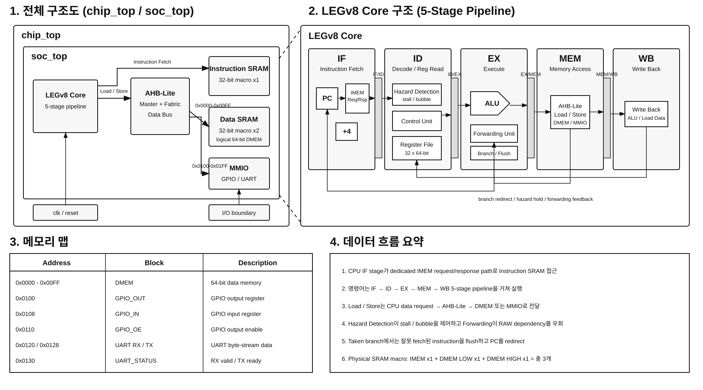

# LEGv8 5-Stage Pipelined CPU SoC

LEGv8 기반 5-stage pipelined CPU를 출발점으로 SRAM hard macro, AHB-Lite data bus, MMIO를 포함하는 소형 SoC 구조로 확장한 프로젝트입니다.

최종 목표는 RTL 기능 확장 자체보다 **Sky130 기반 RTL-to-GDSII 및 Physical Design 분석**입니다.

<p align="center">
  
</p>

## Project Summary

- LEGv8 5-stage pipeline: `IF / ID / EX / MEM / WB`
- Data hazard detection / load-use stall
- EX/MEM, MEM/WB forwarding
- Conditional / unconditional branch 및 pipeline flush
- Instruction SRAM hard macro 1개
- Data SRAM hard macro 2개를 병렬 구성한 logical 64-bit DMEM
- CPU load/store용 AHB-Lite data path
- Memory-mapped GPIO / UART
- External image loader 기반 simulation infrastructure
- Sky130 SRAM hard macro를 포함한 RTL-to-GDSII 진행

## Architecture

### CPU Core

CPU는 5-stage pipeline 구조입니다.

```text
IF -> IF/ID -> ID -> ID/EX -> EX -> EX/MEM -> MEM -> MEM/WB -> WB
```

주요 pipeline 제어 기능은 다음과 같습니다.

- Hazard Detection: dependency 발생 시 stall / bubble 삽입
- Forwarding: EX/MEM 및 MEM/WB 결과를 EX stage로 bypass
- Branch Handling: conditional / unconditional branch 처리
- Flush: taken branch 시 잘못 fetch된 instruction 제거
- Memory Wait: DMEM access 완료까지 pipeline hold

### Instruction Memory

Instruction memory는 다음 SRAM macro 1개를 사용합니다.

```text
sky130_sram_1kbyte_1rw1r_32x256_8
256 words x 32-bit = 1 KB
```

- Port 0: loader write
- Port 1: CPU instruction read
- CPU fetch는 dedicated request/response interface 사용
- SRAM read latency를 고려해 response buffering 적용

### Data Memory

64-bit data memory는 동일한 32-bit SRAM macro 2개를 병렬로 사용합니다.

```text
64-bit DMEM

[63:32] -> SRAM_HIGH : 32-bit
[31:0 ] -> SRAM_LOW  : 32-bit
```

따라서 physical SRAM macro는 총 3개입니다.

```text
IMEM       32-bit SRAM x1
DMEM LOW   32-bit SRAM x1
DMEM HIGH  32-bit SRAM x1
--------------------------
Total      32-bit SRAM x3
```

## AHB-Lite Data Bus

CPU의 load/store와 loader의 DMEM write는 하나의 AHB-Lite data path를 공유합니다.

```text
Loading Phase
Loader -> AHB-Lite Master -> Fabric -> DMEM

Runtime Phase
CPU    -> AHB-Lite Master -> Fabric -> DMEM / MMIO
```

현재 구현은 single-master / single-transfer 중심의 최소 AHB-Lite subset입니다.

주요 신호:

`HADDR`, `HTRANS`, `HWRITE`, `HSIZE`, `HBURST`, `HPROT`, `HWDATA`, `HRDATA`, `HREADY`, `HRESP`

## MMIO Map

| Address | Peripheral |
|---|---|
| `0x0000 ~ 0x00FF` | DMEM |
| `0x0100` | GPIO_OUT |
| `0x0108` | GPIO_IN |
| `0x0110` | GPIO_OE |
| `0x0120` | UART_RXDATA |
| `0x0128` | UART_TXDATA |
| `0x0130` | UART_STATUS |

UART는 byte-stream FIFO/MMIO 경계까지 구현되어 있으며 bit-level UART PHY는 현재 프로젝트 범위에서 제외합니다.

## Verification

Directed regression에서 다음 항목을 확인합니다.

- Register result checking
- Load-use hazard
- Stall 위치 및 횟수
- MEM/WB forwarding
- Conditional branch taken / not-taken
- Unconditional branch
- Pipeline hold assertion
- Forwarding select legality
- Stall control consistency

AHB-Lite integration 단계에서 기존 directed regression **40/40 PASS**를 확인했습니다.

대표 expected register results:

```text
x1  = 2
x3  = 5
x9  = 99
x12 = 101
x13 = 98
x22 = 24
x24 = 26
```

External memory / FIFO / Loader는 프로그램과 초기 데이터를 simulation에서 적재하기 위한 **verification infrastructure**이며 runtime instruction fetch path는 아닙니다.

## Repository Structure

```text
.
├── rtl/
│   ├── core.sv
│   ├── datapath.sv
│   ├── control.sv
│   ├── hazard_detection_unit.sv
│   ├── forwarding_unit.sv
│   ├── ahb_lite_master.sv
│   ├── ahb_lite_fabric.sv
│   ├── sram_wrapper32b.sv
│   ├── sram_wrapper.sv
│   ├── mmio_subsystem.sv
│   ├── mmio_gpio.sv
│   ├── mmio_uart.sv
│   ├── soc_top.sv
│   └── ...
├── tb/
├── constraints/
├── physical_design/
├── docs/
│   └── architecture_bw.svg
└── README.md
```

기존 standalone CPU 학습용 RTL과 testbench는 설계 발전 과정을 보존하기 위해 repository에 유지합니다.

## Physical Design Direction

```text
RTL
 -> Synthesis
 -> Floorplan
 -> SRAM Macro Placement
 -> PDN
 -> Placement
 -> CTS
 -> Routing
 -> STA / Timing Closure
 -> DRC / LVS
 -> GDSII
```

주요 PD 관심 항목:

- SRAM hard macro integration
- Macro placement / halo / blockage
- Standard-cell utilization
- Congestion
- Clock Tree Synthesis
- Setup / Hold timing
- Cell delay / Net delay 분석
- Routing / Timing closure
- Sky130 기반 DRC / LVS

## Scope

이 프로젝트는 완전한 commercial MCU 구현을 목표로 하지 않습니다.

> **5-stage LEGv8 CPU + AHB-Lite + SRAM hard macros + MMIO를 포함한 small SoC를 구성하고, 이를 Sky130에서 RTL-to-GDSII까지 구현 및 분석하는 것**

Cache, DDR controller, DMA, interrupt controller, bit-level UART PHY 등은 현재 핵심 범위에서 제외합니다.
