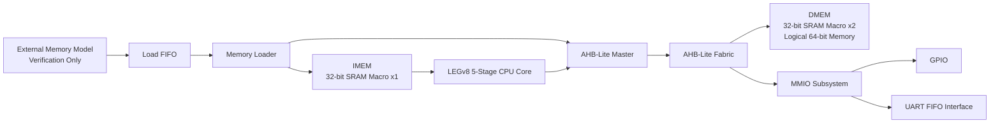
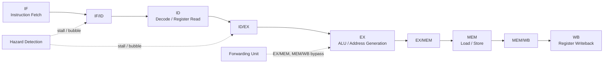

# LEGv8 5-Stage Pipelined CPU SoC

## Overview

이 프로젝트는 LEGv8 기반 5-stage pipelined CPU를 출발점으로, SRAM hard macro와 AHB-Lite 기반 data path, memory-mapped I/O를 포함하는 소형 SoC 구조로 확장한 프로젝트입니다.

최종 목표는 RTL 동작 검증 자체보다 **Sky130 기반 RTL-to-GDSII 구현과 Physical Design 분석**에 있습니다.

핵심 구성은 다음과 같습니다.

- LEGv8 5-stage pipeline: IF / ID / EX / MEM / WB
- Hazard detection / forwarding
- Branch 처리 및 pipeline flush
- Instruction SRAM hard macro 1개
- Data SRAM hard macro 2개로 구성한 64-bit DMEM
- AHB-Lite 기반 CPU data bus
- MMIO GPIO / UART
- External image loader 기반 simulation infrastructure

---

## System Architecture



### Runtime Data Flow

```text
Instruction Fetch
CPU IF  <---------------- IMEM SRAM

Load / Store
CPU MEM --> AHB-Lite Master --> AHB-Lite Fabric --> DMEM / MMIO
```

External memory/FIFO/loader는 프로그램 및 초기 데이터를 simulation에서 적재하기 위한 verification infrastructure이며, CPU의 runtime instruction fetch path가 아닙니다.

---

## CPU Core

CPU는 5-stage pipeline 구조입니다.



주요 기능:

- Data hazard detection
- Load-use stall
- EX/MEM 및 MEM/WB forwarding
- Conditional / unconditional branch 처리
- Taken branch 시 잘못 fetch된 instruction flush
- Memory wait 발생 시 pipeline hold

---

## Memory Architecture

### Instruction Memory

- Macro: `sky130_sram_1kbyte_1rw1r_32x256_8`
- 256 words x 32-bit = 1 KB
- Physical macro count: 1
- Port 0: loader write
- Port 1: CPU instruction read

Instruction fetch는 SRAM read latency를 고려한 request/response 구조와 response buffering을 사용합니다.

### Data Memory

논리적으로 64-bit data memory를 구성하기 위해 동일한 32-bit SRAM macro 두 개를 병렬로 사용합니다.

```text
64-bit DMEM

[63:32] --> SRAM_HIGH : 32-bit
[31:0 ] --> SRAM_LOW  : 32-bit
```

따라서 전체 physical SRAM macro 수는 다음과 같습니다.

```text
IMEM       32-bit SRAM x1
DMEM LOW   32-bit SRAM x1
DMEM HIGH  32-bit SRAM x1
--------------------------
Total      32-bit SRAM x3
```

---

## AHB-Lite Data Bus

CPU의 load/store와 loader의 DMEM write는 하나의 AHB-Lite data path를 공유합니다.

```text
Loading Phase
Loader --> AHB-Lite Master --> Fabric --> DMEM

Runtime Phase
CPU    --> AHB-Lite Master --> Fabric --> DMEM / MMIO
```

현재 프로젝트에서는 single-master / single-transfer 중심의 최소 AHB-Lite subset을 사용합니다.

주요 신호:

- `HADDR`
- `HTRANS`
- `HWRITE`
- `HSIZE`
- `HBURST`
- `HPROT`
- `HWDATA`
- `HRDATA`
- `HREADY`
- `HRESP`

---

## MMIO

현재 memory map:

| Address | Peripheral |
|---|---|
| `0x0100` | GPIO_OUT |
| `0x0108` | GPIO_IN |
| `0x0110` | GPIO_OE |
| `0x0120` | UART_RXDATA |
| `0x0128` | UART_TXDATA |
| `0x0130` | UART_STATUS |

UART는 현재 byte-stream FIFO/MMIO 경계까지 구현되어 있으며, bit-level UART PHY는 본 프로젝트의 핵심 범위에서 제외합니다.

---

## Verification

Directed regression은 다음 항목을 확인하도록 구성되어 있습니다.

- Register result checking
- Load-use hazard
- Stall 발생 위치 및 횟수
- MEM/WB forwarding
- Conditional branch taken / not-taken
- Unconditional branch
- Pipeline hold assertion
- Forwarding select legality
- Stall control consistency

AHB-Lite integration 단계에서 기존 directed regression **40/40 PASS**를 확인했습니다.

대표 expected register results:

```text
x1  = 2
x3  = 5
x9  = 99
x12 = 101
x13 = 98
x22 = 24
x24 = 26
```

---

## Repository Structure

```text
.
├── rtl/
│   ├── core.sv
│   ├── datapath.sv
│   ├── control.sv
│   ├── hazard_detection_unit.sv
│   ├── forwarding_unit.sv
│   ├── ahb_lite_master.sv
│   ├── ahb_lite_fabric.sv
│   ├── sram_wrapper32b.sv
│   ├── sram_wrapper.sv
│   ├── mmio_subsystem.sv
│   ├── mmio_gpio.sv
│   ├── mmio_uart.sv
│   ├── soc_top.sv
│   └── ...
│
├── tb/
│   ├── soc_top_tb.sv
│   ├── external_memory_model.sv
│   └── ...
│
├── constraints/
├── physical_design/
├── docs/
└── README.md
```

기존 standalone CPU 학습용 RTL 및 testbench도 설계 발전 과정을 보존하기 위해 repository에 유지합니다.

---

## Physical Design Direction

RTL 기능을 계속 확장하기보다, 이후 작업은 아래 RTL-to-GDSII flow에 집중합니다.

```text
RTL
 ↓
Synthesis
 ↓
Floorplan
 ↓
SRAM Macro Placement
 ↓
PDN
 ↓
Placement
 ↓
CTS
 ↓
Routing
 ↓
STA / Timing Closure
 ↓
DRC / LVS
 ↓
GDSII
```

주요 PD 관심 항목:

- SRAM hard macro integration
- Macro placement / halo / blockage
- Standard-cell utilization
- Congestion
- Clock tree synthesis
- Setup / hold timing
- Net delay / cell delay 분석
- Routing 및 timing closure
- Sky130 기반 DRC/LVS

---

## Project Scope

이 프로젝트는 완전한 commercial MCU 구현을 목표로 하지 않습니다.

범위는 다음에 집중합니다.

> **5-stage LEGv8 CPU + AHB-Lite + SRAM hard macros + MMIO를 포함한 small SoC를 구성하고, 이를 Sky130에서 RTL-to-GDSII까지 구현 및 분석하는 것**

UART PHY, cache, DDR controller, DMA, interrupt controller 등은 필요 이상으로 RTL 범위를 확장하지 않기 위해 현재 scope에서 제외합니다.
